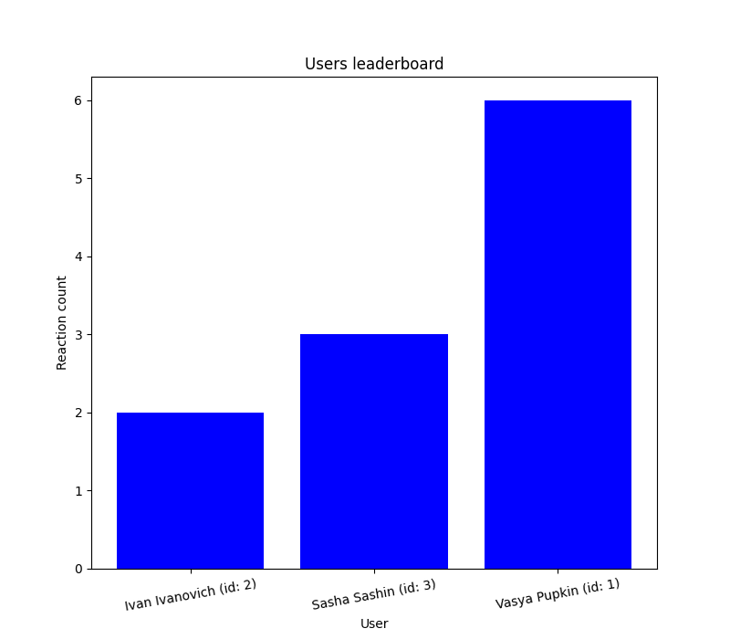

# Social network API

Social network API, which has following functions:

+ Create a user, who can write posts, react to posts with emojis
+ Give information about some user by user id
+ Delete a user by user id 
+ Create a post 
+ Give information about some post by post id 
+ Delete a post by post id 
+ React to a post by post id
+ Give information about some reaction by reaction id
+ Delete a reaction to the post by reaction id
+ Give all the posts of the user, sorted by reaction count 
+ Generate a list of users, sorted by their reaction count 
+ Generate a graph of users, based on their reaction count 

# Requests and responses

## Errors
Each of the requests can return errors in the following format:
```json
{
    "errors": {
        "error_type1": "error_description",
        "error_type2": "error_description",
        ...
    }
}
```

- Creating a user `POST /users/create`

Request example:
```json
{
  "first_name": "Vasya",
  "last_name": "Pupkin",
  "email": "example@example.com",
}
```

Response example:
```json
{
  "id": 1,
  "first_name": "Vasya",
  "last_name": "Pupkin",
  "email": "example@example.com",
  "total_reactions": 0,
  "posts": []
}
```

- Getting information about some user by user id `GET /users/<user_id>`

Request example:
`GET /users/1`

Response example:
```json
{
  "id": 1,
  "first_name": "Vasya",
  "last_name": "Pupkin",
  "email": "example@example.com",
  "total_reactions": 0,
  "posts": [
        "Hello everyone!",
        "How was your day today?"
  ]
}
```
- Deleting a user by id `POST /users/delete/<user_id>`
(Deleting a user also deletes all of his reaction from the posts
and all of his posts for which it also deletes all of the reactions from the corresponding users)

Request example:
`POST /users/delete/1`

Response example:
An error if user with such id doesn't exist or an empty response otherwise

- Creating a post `POST /posts/create`

Request example:
```json
{
  "author_id": 1,
  "text": "Hello everyone!"
}
```

Response example:
```json
{
  "id": 1,
  "author_id": 1,
  "text": "Hello everyone!",
  "reactions": [] 
}
```

- Getting information about some post by post id `GET /posts/<post_id>`

Request example:
`GET /posts/1`

Response example:
```json
{
  "id": 1,
  "author_id": 1,
  "text": "Hello everyone!",
  "reactions": [
  	"👍",
    "👎",
    "❤️"
  ] 
}
```
- Deleting a post by post id `POST /posts/delete/<post_id>`
(Deleting a post also deletes all of the reactions)

Request example:
`POST /posts/delete/1`

Response example:
An error if a post with such id doesn't exist or an empty response otherwise


- Reacting to a post by post id  `POST /reactions/react/<post_id>`
(A reaction should be a single emoji or a string in the following format - :unicode_emoji_CLDR_short_name:")

Request example:
`POST /reactions/react/1`

```json
{
    "user_id": 1, 
    "reaction": "👍" 
}
```

Response example:
```json
{
   "reaction": "👍",
    "reaction_id": 1
}
```

- Getting information about some reaction by reaction id `GET /reactions/<reaction_id>`

Request example:
`GET /reactions/1`

Response example:
```json
{
    "id": 1,
    "post_id": 3,
    "author_id": 1,
    "reaction": "👍"
}
```

- Deleting a reaction by reaction id `POST /reactions/delete/<reaction_id>`

Request example:
`POST /reactions/delete/1`

Response example:
An error if a reaction with such id doesn't exist or an empty response otherwise

- Getting all the posts of the user sorted by the reaction count `POST /users/<user_id>/posts`

Parameter `sort_type` can  be either `asc` or `desc`:
    + `asc` corresponds to `ascending` (order)
    + `desc` corresponds to `descending` (order)

Request example:
`POST /users/2/posts`

```json
{
  "sort_type": "asc"
}
```

Response example:
```json
{
	{
    "posts": [
        {
            "id": 4,
            "author_id": 2,
            "text": "Hi everyone!",
            "reactions": [
                "👍",
                "👍"
            ]
        },
        {
            "id": 3,
            "author_id": 2,
            "text": "Try out my new programming course with the link down below!",
            "reactions": [
                "👍",
                "👍",
                "👍"
            ]
        }
    ]
}
}
```
Request example:
`POST /users/2/posts`

```json
{
  "sort_type": "desc"
}
```

Response example:
```
    "posts": [
        {
            "id": 3,
            "author_id": 2,
            "text": "Try out my new programming course with the link down below!",
            "reactions": [
                "👍",
                "👍",
                "👍"
            ]
        },
        {
            "id": 4,
            "author_id": 2,
            "text": "Hi everyone!",
            "reactions": [
                "👍",
                "👍"
            ]
        }
    ]
}
```


- Getting all the users, sorted by reaction count `POST /users/leaderboard`

Parameter `sort_type` can  be either `asc` or `desc`:
    + `asc` corresponds to `ascending` (order)
    + `desc` corresponds to `descending` (order)

Parameter `type` can be either `list` or `graph`

Request example:
```json
{
  "type": "list",
  "sort_type": "asc"
}
```

Response example:
```json
{
	{
    "users": [
        {
            "id": 2,
            "first_name": "Ivan",
            "last_name": "Ivanovich",
            "email": "example1@example.com",
            "total_reactions": 2,
            "posts": []
        },
        {
            "id": 3,
            "first_name": "Sasha",
            "last_name": "Sashin",
            "email": "example2@example.com",
            "total_reactions": 3,
            "posts": []
        },
        {
            "id": 1,
            "first_name": "Vasya",
            "last_name": "Pupkin",
            "email": "example@example.com",
            "total_reactions": 6,
            "posts": [
                "It was a hard day for me today",
                "Hello everyone!"
            ]
        }
    ]
}
}
```

Request example:
```json
{
  "type": "graph",
  "sort_type": "asc"
}
```

Response example:

